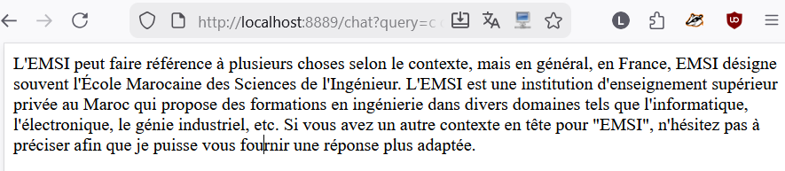
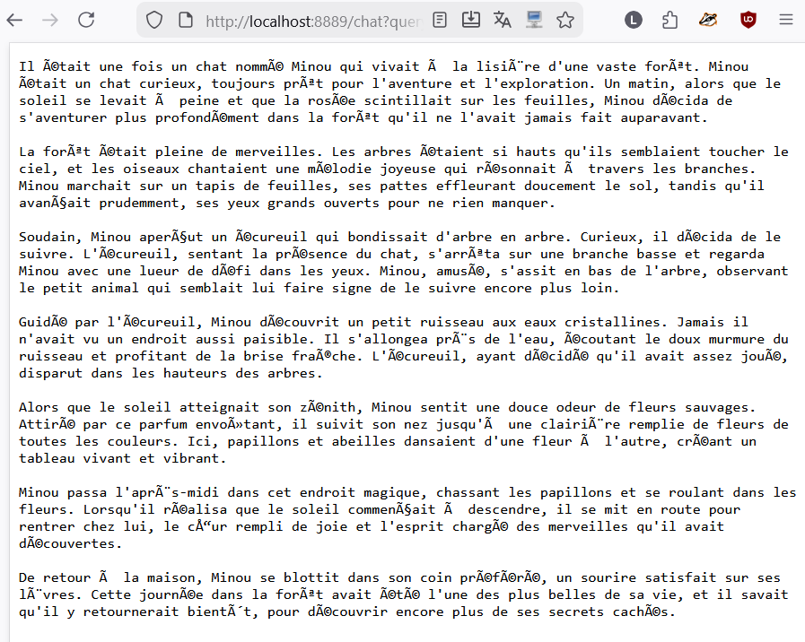
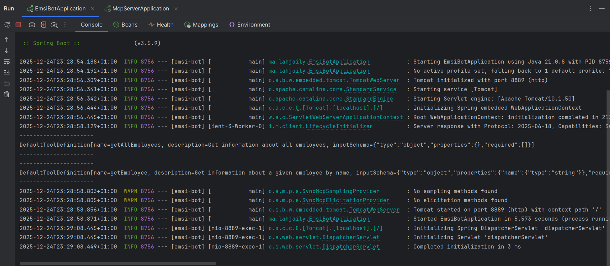
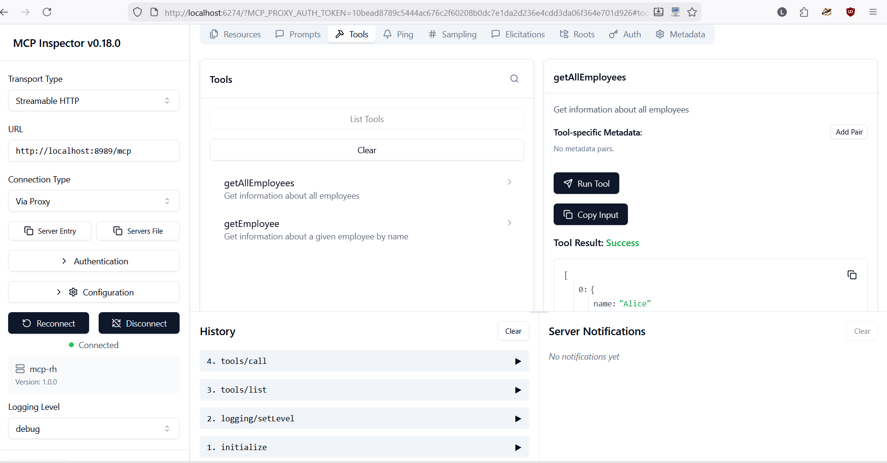
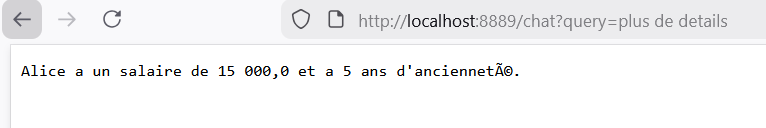
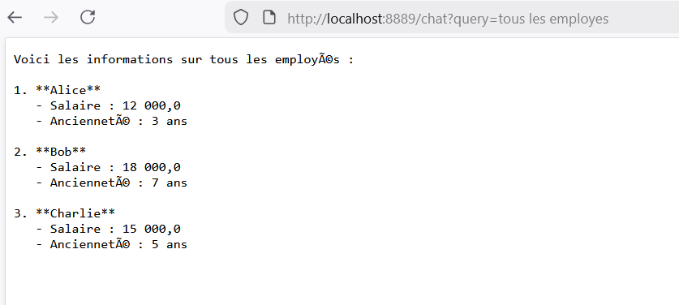
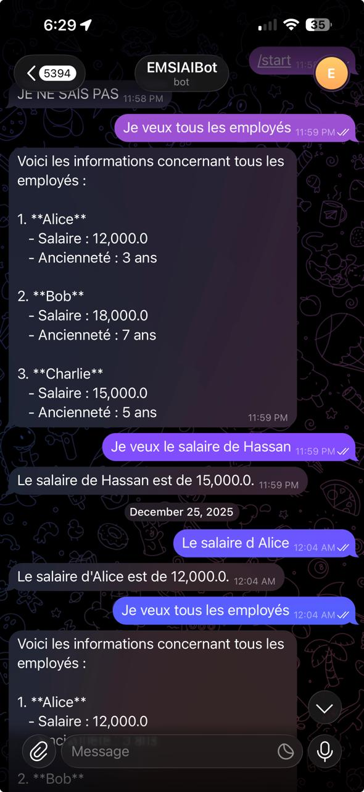
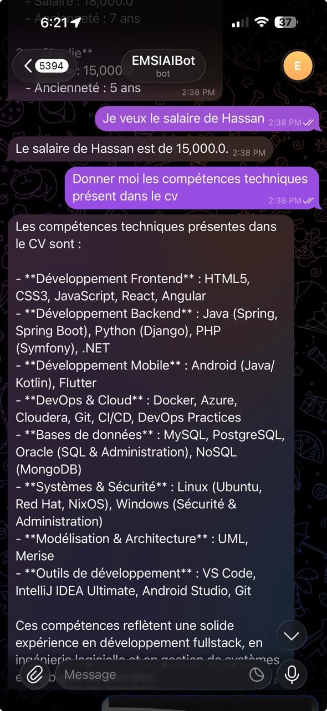
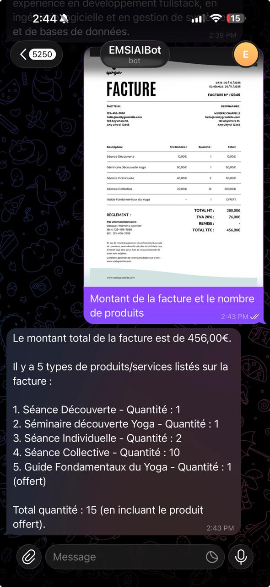
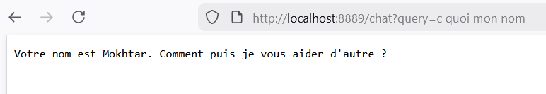

# 🤖 EMSI Bot - Chatbot RAG avec Telegram & MCP

<div align="center">


**Chatbot intelligent basé sur RAG (Retrieval Augmented Generation) avec intégration Telegram et MCP (Model Context Protocol)**

</div>

---

## 📋 Table des Matières

- [📖 À Propos du Projet](#-à-propos-du-projet)
- [🏗️ Architecture du Système](#️-architecture-du-système)
- [🔧 Technologies Utilisées](#-technologies-utilisées)
- [📂 Structure du Projet](#-structure-du-projet)
- [🚀 Démarrage Rapide](#-démarrage-rapide)
- [⚙️ Configuration](#️-configuration)
- [📸 Captures d'Écran & Démonstrations](#-captures-décran--démonstrations)
- [📡 API Endpoints](#-api-endpoints)
- [📚 Ressources Pédagogiques](#-ressources-pédagogiques)
- [👤 Auteur](#-auteur)

---

## 📖 À Propos du Projet

Ce projet académique implémente un **chatbot intelligent** basé sur l'architecture **RAG (Retrieval Augmented Generation)** avec plusieurs interfaces :

- 🤖 **Bot Telegram** : Interface conversationnelle via Telegram
- 🌐 **API REST** : Interface web pour les requêtes HTTP
- 📄 **RAG avec PDF** : Analyse et interrogation de documents PDF
- 🔗 **MCP Server** : Serveur Model Context Protocol pour les outils externes
- 🖼️ **Vision AI** : Support des images dans les conversations

### Fonctionnalités Principales

- 💬 **Chat Conversationnel** : Dialogue naturel avec mémoire de contexte
- 📚 **RAG (Retrieval Augmented Generation)** : Réponses basées sur des documents indexés
- 🖼️ **Analyse d'Images** : Traitement et description d'images via GPT-4o Vision
- 🛠️ **Outils MCP** : Intégration d'outils externes via le protocole MCP
- 📝 **Indexation PDF** : Extraction et vectorisation de documents PDF
- 💾 **Mémoire de Chat** : Persistance du contexte conversationnel

### Objectifs Pédagogiques

Ce projet a été réalisé dans le cadre du cours **J2EE** sous la supervision du **Prof. Mohamed YOUSSFI**, permettant d'acquérir des compétences sur :

- ✅ Spring AI et intégration LLM (Large Language Models)
- ✅ Architecture RAG avec Vector Store
- ✅ Model Context Protocol (MCP)
- ✅ Développement de bots Telegram
- ✅ Traitement de documents PDF
- ✅ Embeddings et recherche sémantique
- ✅ API Vision pour l'analyse d'images

---

## 🏗️ Architecture du Système

```
┌──────────────────────────────────────────────────────────────────────────┐
│                         ARCHITECTURE EMSI-BOT                            │
├──────────────────────────────────────────────────────────────────────────┤
│                                                                          │
│    ┌─────────────────┐         ┌─────────────────┐                       │
│    │  Telegram User  │────────▶│   Telegram Bot  │                       │
│    │  (Messages/Imgs)│         │   :8889         │                       │
│    └─────────────────┘         └────────┬────────┘                       │
│                                         │                                │
│    ┌─────────────────┐                  │                                │
│    │   REST Client   │──────────────────┤                                │
│    │   /chat API     │                  │                                │
│    └─────────────────┘                  │                                │
│                                         ▼                                │
│                          ┌─────────────────────────┐                     │
│                          │       AI Agent          │                     │
│                          │   (ChatClient + Memory) │                     │
│                          └───────────┬─────────────┘                     │
│                                      │                                   │
│              ┌───────────────────────┼───────────────────┐               │
│              │                       │                   │               │
│              ▼                       ▼                   ▼               │
│    ┌─────────────────┐    ┌─────────────────┐   ┌─────────────────┐     │
│    │   OpenAI API    │    │   MCP Server    │   │  Chat Memory    │     │
│    │   (GPT-4o)      │    │     :8989       │   │  (Advisor)      │     │
│    └─────────────────┘    └────────┬────────┘   └─────────────────┘     │
│                                    │                                     │
│                           ┌────────┼────────┐                            │
│                           │        │        │                            │
│                           ▼        ▼        ▼                            │
│                    ┌──────────┐ ┌──────────┐ ┌──────────┐                │
│                    │ MCP Tools│ │ RAG/PDF  │ │ Vector   │                │
│                    │          │ │ Reader   │ │ Store    │                │
│                    └──────────┘ └──────────┘ └──────────┘                │
│                                                                          │
└──────────────────────────────────────────────────────────────────────────┘
```

### Flux de Traitement

```
┌────────┐      ┌──────────────┐      ┌──────────┐      ┌─────────┐
│  User  │─────▶│  Telegram/   │─────▶│ AI Agent │─────▶│ OpenAI  │
│        │      │  REST API    │      │          │      │ GPT-4o  │
└────────┘      └──────────────┘      └──────────┘      └─────────┘
     │                 │                    │                │
     │    Message/     │   Prompt +         │   API Call     │
     │    Image        │   Context          │                │
     │                 │                    │                │
     │                 │                    ▼                │
     │                 │          ┌──────────────────┐       │
     │                 │          │   MCP Server     │       │
     │                 │          │  (Tools + RAG)   │       │
     │                 │          └──────────────────┘       │
     │                 │                    │                │
     │                 │                    │ Context        │
     │                 │                    │ + Tools        │
     │                 │                    ▼                │
     │                 │          ┌──────────────────┐       │
     │                 │          │  Vector Store    │       │
     │                 │          │  (Embeddings)    │       │
     │                 │          └──────────────────┘       │
     │◀────────────────│◀───────────────────│◀───────────────│
     │     Response    │                    │                │
```

### Composants Principaux

| Composant | Description | Port |
|-----------|-------------|------|
| **EMSI Bot** | Application principale avec Telegram Bot et Agent AI | 8889 |
| **MCP Server** | Serveur MCP avec outils et RAG | 8989 |
| **OpenAI API** | API externe pour GPT-4o | - |
| **Telegram API** | API externe pour le bot | - |

---

## 🔧 Technologies Utilisées

### Backend & AI
| Technologie | Version | Description |
|-------------|---------|-------------|
| **Java** | 21 (LTS) | Langage de programmation principal |
| **Spring Boot** | 3.5.9 | Framework de développement |
| **Spring AI** | 1.1.2 | Framework d'intégration AI |
| **OpenAI GPT-4o** | - | Modèle de langage multimodal |

### RAG & Vector Store
| Technologie | Description |
|-------------|-------------|
| **SimpleVectorStore** | Store de vecteurs intégré Spring AI |
| **PDF Document Reader** | Lecteur de documents PDF |
| **Token Text Splitter** | Segmentation des documents |
| **Embeddings** | Vectorisation via OpenAI |

### MCP (Model Context Protocol)
| Technologie | Description |
|-------------|-------------|
| **MCP Server WebMVC** | Serveur MCP avec Spring MVC |
| **MCP Client** | Client MCP intégré |
| **Streamable HTTP** | Protocole de communication |

### Bot Telegram
| Technologie | Version | Description |
|-------------|---------|-------------|
| **TelegramBots Spring Boot Starter** | 6.9.7.1 | SDK Telegram pour Spring |
| **Long Polling** | - | Méthode de réception des messages |

### Outils & Build
| Technologie | Description |
|-------------|-------------|
| **Maven** | Gestionnaire de dépendances |
| **Spring Boot Maven Plugin** | Build et packaging |

---

## 📂 Structure du Projet

```
emsi-bot/
│
├── 📁 src/
│   ├── 📁 main/
│   │   ├── 📁 java/ma/lahjaily/
│   │   │   ├── 📄 EmsiBotApplication.java    # Point d'entrée principal
│   │   │   │
│   │   │   ├── 📁 agents/
│   │   │   │   └── 📄 AIAgent.java           # Agent AI avec ChatClient
│   │   │   │
│   │   │   ├── 📁 telegram/
│   │   │   │   └── 📄 TelegramBot.java       # Bot Telegram Long Polling
│   │   │   │
│   │   │   └── 📁 web/
│   │   │       └── 📄 ChatController.java    # API REST /chat
│   │   │
│   │   └── 📁 resources/
│   │       ├── 📄 application.properties     # Configuration principale
│   │       └── 📁 store/
│   │           └── 📄 store.json             # Persistance Vector Store
│   │
│   └── 📁 test/                              # Tests unitaires
│
├── 📁 mcp-server/                            # Sous-projet MCP Server
│   ├── 📁 src/
│   │   ├── 📁 main/
│   │   │   ├── 📁 java/ma/lahjaily/mcpserver/
│   │   │   │   ├── 📄 McpServerApplication.java  # Point d'entrée MCP
│   │   │   │   │
│   │   │   │   ├── 📁 rag/
│   │   │   │   │   └── 📄 DocumentIndexor.java   # Indexation PDF → Vectors
│   │   │   │   │
│   │   │   │   └── 📁 tools/
│   │   │   │       └── 📄 McpTools.java          # Outils MCP exposés
│   │   │   │
│   │   │   └── 📁 resources/
│   │   │       ├── 📄 application.properties     # Config MCP Server
│   │   │       ├── 📁 pdfs/
│   │   │       │   └── 📄 cv.pdf                 # Document PDF à indexer
│   │   │       └── 📁 store/
│   │   │           └── 📄 store.json             # Persistance embeddings
│   │   │
│   │   └── 📁 test/
│   │
│   └── 📄 pom.xml                            # Dépendances MCP Server
│
├── 📁 captures/                              # Screenshots documentation
├── 📄 pom.xml                                # Dépendances principales
└── 📄 README.md
```

---

## 🚀 Démarrage Rapide

### Prérequis

| Outil | Version | Vérification |
|-------|---------|--------------|
| ☕ **Java JDK** | 21+ | `java -version` |
| 📦 **Maven** | 3.8+ | `mvn -version` |
| 🔑 **OpenAI API Key** | - | [Obtenir une clé](https://platform.openai.com/api-keys) |
| 🤖 **Telegram Bot Token** | - | Via [@BotFather](https://t.me/botfather) |

### Configuration des Variables d'Environnement

```bash
# Windows (PowerShell)
$env:OPENAI_API_KEY="sk-your-openai-api-key"
$env:TELEGRAM_API_KEY="your-telegram-bot-token"

# Linux/macOS
export OPENAI_API_KEY="sk-your-openai-api-key"
export TELEGRAM_API_KEY="your-telegram-bot-token"
```

### Lancement des Services

```bash
# 1. Cloner le repository
git clone https://github.com/MokhtarLahjaily/emsi-bot.git
cd emsi-bot

# 2. Démarrer le MCP Server (Terminal 1)
cd mcp-server
./mvnw spring-boot:run

# 3. Démarrer le Bot Principal (Terminal 2)
cd ..
./mvnw spring-boot:run
```

### Vérification du Démarrage

| Service | URL | Description |
|---------|-----|-------------|
| **EMSI Bot** | http://localhost:8889 | Application principale |
| **MCP Server** | http://localhost:8989/mcp | Serveur MCP |
| **API Chat** | http://localhost:8889/chat?query=Hello | Test API REST |

---

## ⚙️ Configuration

### Configuration Principale (emsi-bot)

```properties
# application.properties
spring.application.name=emsi-bot

# OpenAI Configuration
spring.ai.openai.api-key=${OPENAI_API_KEY}
spring.ai.openai.chat.options.model=gpt-4o

# Server Configuration
server.port=8889

# MCP Client Configuration
spring.ai.mcp.client.streamable-http.connections.mcprh.url=http://localhost:8989/mcp

# Telegram Bot Configuration
telegram.api.key=${TELEGRAM_API_KEY}

# Debug Logging
logging.level.org.springframework.ai.chat.client.advisor=DEBUG
```

### Configuration MCP Server

```properties
# mcp-server/application.properties
spring.application.name=mcp-server

# MCP Server Configuration
spring.ai.mcp.server.protocol=streamable
spring.ai.mcp.server.name=mcp-rh
server.port=8989

# OpenAI for Embeddings
spring.ai.openai.api-key=${OPENAI_API_KEY}
```

### Création du Bot Telegram

1. Ouvrir Telegram et rechercher **@BotFather**
2. Envoyer la commande `/newbot`
3. Suivre les instructions pour nommer votre bot
4. Copier le token API fourni
5. Configurer le token dans les variables d'environnement

---

## 📸 Captures d'Écran & Démonstrations

### 1️⃣ Test Initial du Bot Telegram (V1)



> **📸 Figure 1** : Première version du bot Telegram en fonctionnement. Test initial de la communication entre l'utilisateur et le bot via l'API Telegram, démontrant la réception et le traitement des messages.

---

### 2️⃣ Test Amélioré du Bot (V2)



> **📸 Figure 2** : Version améliorée du bot avec des fonctionnalités étendues. Cette itération inclut une meilleure gestion des réponses et l'intégration avec l'agent AI.

---

### 3️⃣ Connexion Agent - Serveur MCP



> **📸 Figure 3** : Démonstration de la connexion réussie entre l'agent AI principal et le serveur MCP. Les logs montrent l'établissement de la communication via le protocole Streamable HTTP sur le port 8989.

---

### 4️⃣ Test du Serveur MCP



> **📸 Figure 4** : Console de test du serveur MCP. Le serveur expose les outils (`getEmployee`, `getAllEmployees`, `getContext`) via le protocole MCP, permettant à l'agent de les invoquer dynamiquement.

---

### 5️⃣ Test des Outils MCP (1)



> **📸 Figure 5** : Premier test d'invocation d'un outil MCP. Lorsque l'utilisateur demande des informations sur les employés, l'agent AI invoque automatiquement l'outil approprié exposé par le serveur MCP.

---

### 6️⃣ Test des Outils MCP (2)



> **📸 Figure 6** : Second test démontrant l'utilisation de plusieurs outils MCP. L'agent sélectionne intelligemment l'outil le plus pertinent en fonction de la requête utilisateur.

---

### 7️⃣ Test Outil MCP via Telegram



> **📸 Figure 7** : Démonstration de l'invocation d'un outil MCP directement via l'interface Telegram. L'utilisateur pose une question et le bot utilise les outils MCP pour fournir une réponse enrichie.

---

### 8️⃣ Test RAG avec CV via Telegram



> **📸 Figure 8** : Exemple d'interrogation du système RAG via Telegram. Le bot utilise le contexte extrait du document PDF indexé (CV) pour fournir des réponses précises et contextualisées sur les compétences et l'expérience.

---

### 9️⃣ Analyse d'Image (OCR) via Telegram



> **📸 Figure 9** : Démonstration de la fonctionnalité Vision/OCR. L'utilisateur envoie une image et le bot utilise GPT-4o Vision pour analyser, extraire le texte et décrire le contenu de l'image en détail.

---

### 🔟 Test de la Mémoire de Conversation



> **📸 Figure 10** : Illustration de la mémoire de conversation. Le bot maintient le contexte des échanges précédents grâce au `MessageChatMemoryAdvisor`, permettant des conversations cohérentes et contextualisées sur plusieurs messages.

---

## 📡 API Endpoints

### EMSI Bot (Port 8889)

| Méthode | Endpoint | Description | Paramètres |
|---------|----------|-------------|------------|
| `GET` | `/chat` | Envoyer une question au chatbot | `query` (string) |

#### Exemple d'utilisation

```bash
# Requête simple
curl "http://localhost:8889/chat?query=Bonjour"

# Requête avec RAG
curl "http://localhost:8889/chat?query=Quelles%20sont%20les%20compétences%20dans%20le%20CV"

# Utilisation d'un outil MCP
curl "http://localhost:8889/chat?query=Donne%20moi%20la%20liste%20des%20employés"
```

### MCP Server (Port 8989)

| Endpoint | Description |
|----------|-------------|
| `/mcp` | Point d'entrée MCP Streamable HTTP |

#### Outils MCP Exposés

| Outil | Description | Paramètres |
|-------|-------------|------------|
| `getEmployee` | Obtenir info d'un employé | `name` (string) |
| `getAllEmployees` | Liste de tous les employés | - |
| `getContext` | Recherche RAG dans le CV | `query` (string) |

---

## 🔍 Détails Techniques

### Agent AI (AIAgent.java)

L'agent AI est le cœur du système. Il utilise :

- **ChatClient** : Client Spring AI pour communiquer avec OpenAI
- **MessageChatMemoryAdvisor** : Gestion de la mémoire de conversation
- **ToolCallbackProvider** : Intégration des outils MCP

```java
@Component
public class AIAgent {
    private ChatClient chatClient;

    public AIAgent(ChatClient.Builder builder,
                   ChatMemory memory, ToolCallbackProvider tools) {
        this.chatClient = builder
            .defaultSystem("Vous êtes un assistant...")
            .defaultAdvisors(MessageChatMemoryAdvisor.builder(memory).build())
            .defaultToolCallbacks(tools)
            .build();
    }

    public String askAgent(Prompt prompt) {
        return chatClient.prompt(prompt).call().content();
    }
}
```

### RAG avec DocumentIndexor

Le système RAG indexe des documents PDF pour enrichir les réponses :

1. **Lecture** : `PagePdfDocumentReader` lit le PDF
2. **Segmentation** : `TokenTextSplitter` découpe en chunks
3. **Vectorisation** : OpenAI Embeddings génère les vecteurs
4. **Stockage** : `SimpleVectorStore` persiste dans `store.json`

### Bot Telegram Multi-modal

Le bot supporte :
- **Messages texte** : Questions simples
- **Images avec légende** : Analyse Vision via GPT-4o
- **Indicateur de frappe** : Feedback utilisateur pendant le traitement

---

## 📚 Ressources Pédagogiques

### Vidéos de Référence

| Titre | Lien | Description |
|-------|------|-------------|
| **Chatbot RAG avec Telegram** | [YouTube](https://www.youtube.com/watch?v=Q12plqwksxk) | Implémentation du chatbot Telegram |
| **Intégration RAG** | [YouTube](https://www.youtube.com/watch?v=iIdmOcZcapM) | Architecture RAG avec Spring AI |
| **Images & MCP** | [YouTube](https://www.youtube.com/watch?v=mOCYursBxtw) | Vision AI et Model Context Protocol |

### Documentation Officielle

| Ressource | Lien |
|-----------|------|
| **Spring AI** | [spring.io/projects/spring-ai](https://spring.io/projects/spring-ai) |
| **MCP Specification** | [modelcontextprotocol.io](https://modelcontextprotocol.io) |
| **OpenAI API** | [platform.openai.com/docs](https://platform.openai.com/docs) |
| **Telegram Bot API** | [core.telegram.org/bots/api](https://core.telegram.org/bots/api) |

### Concepts Clés

| Concept | Description |
|---------|-------------|
| **RAG** | Retrieval Augmented Generation - Enrichit les réponses LLM avec des documents externes |
| **MCP** | Model Context Protocol - Standard pour connecter LLMs à des outils externes |
| **Embeddings** | Représentation vectorielle du texte pour la recherche sémantique |
| **Vector Store** | Base de données optimisée pour la recherche de similarité |
| **Chat Memory** | Persistance du contexte conversationnel |

---

## 👤 Auteur

<div align="center">

**Mokhtar LAHJAILY**

Étudiant en 5ème année Ingénierie Informatique et Réseaux (5IIR)  
École Marocaine des Sciences de l'Ingénieur (EMSI)

[](https://github.com/MokhtarLahjaily)

</div>

---

## 📄 Licence

Ce projet est réalisé dans un cadre académique sous la supervision du **Prof. Mohamed YOUSSFI**.

---

<div align="center">

**🎓 Projet Académique - Module J2EE - EMSI**

**Année Universitaire 2025/2026**

</div>
